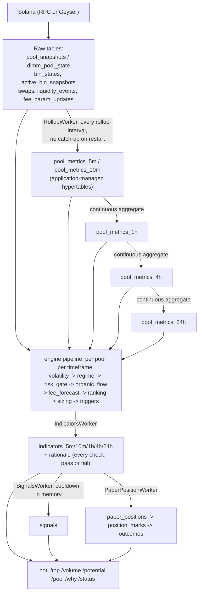

# Architecture

This document describes the system as it exists in the source tree today: four binaries, six
shared libraries, and a Postgres/TimescaleDB schema that is the only channel between them. It does
not describe intent or roadmap beyond what the code already expresses through an unused trait
variant or an empty table column -- those are called out explicitly, not implied.

## The four binaries

```
                    ┌──────────────┐
   Solana ─────────▶│   indexer    │────┐
   (RPC or Geyser)  └──────────────┘    │
                                        ▼
                                  ┌───────────┐      ┌──────────┐
                                  │ Postgres  │◀────▶│  scorer  │
                                  │ Timescale │      └──────────┘
                                  └───────────┘
                                        │
                                  ┌───────────┐
                                  │    bot    │  Telegram, read-only
                                  └───────────┘
```

`indexer` streams chain state and decodes it into rows; it computes nothing. `scorer` reads those
rows, builds rollups, evaluates every indicator, and writes each decision with the inputs that
produced it. `bot` reads and renders; it decides nothing and holds no keys. `crawler` is a fourth,
different shape entirely: a one-shot, operator-run backfill tool, not a long-running worker and not
started by any other binary. It walks `getSignaturesForAddress` backward over a chosen pool set and
slot/time range, decodes each in-range transaction's swap and liquidity events, and writes them into
the same `swaps`/`liquidity_events` tables `indexer` writes -- the tool that exists specifically
because the RPC ingestion backend never captures event-level detail live at all, and the Geyser
backend can still drop a window during an outage. It cannot recover pool *state*
(`pool_snapshots`, `dlmm_pool_state`, `bin_states`, `active_bin_snapshots`) -- a signature walk only
ever sees what a transaction changed, not a full account snapshot at a past slot. See
[`docs/operations.md`](operations.md) for the recovery walkthrough and
[`docs/configuration.md`](configuration.md) for every flag.

Every binary that touches the database (`indexer`, `scorer`, `crawler`) calls
`storage::run_migrations` at startup, which runs `sqlx::migrate!` under Postgres's own advisory
lock, so more than one of them racing to migrate a fresh database at once is safe -- each blocks
until the others finish. `bot` does not run migrations; it only connects.

All three long-running binaries share one lifecycle shape: a set of `Worker` tasks run concurrently
under one `tokio::JoinSet`, and **the first one to exit, for any reason, tears the rest down**. A
tick that fails is caught, logged, and retried on the next interval -- that is normal operation.
A worker that returns `Err` from `run()`, or panics, is not -- it ends the process. There is no
per-worker restart; the operational unit is the whole binary. See
[`docs/operations.md`](operations.md) for what that means for restarts and supervision.

## Two ingestion backends, one trait

```rust
#[async_trait]
pub trait Source: Send + Sync {
    async fn discover_pools(&self) -> Result<Vec<PoolMeta>>;
    fn state_stream(&self, watched: WatchSet) -> BoxStream<'_, StateUpdate>;
    fn event_stream(&self, filter: EventFilter) -> BoxStream<'_, ChainEvent>;
    async fn flow_metrics(&self, pools: &[Pubkey]) -> Result<Option<Vec<FlowMetrics>>>;
}
```

`libraries/source` has two implementations, selected by `--backend rpc|geyser` (default `rpc`) and
nothing else -- both write the same tables, so switching is a config change and a restart, not a
migration or a schema change.

| | RPC polling | Yellowstone Geyser |
|---|---|---|
| Setup | Any RPC provider, works today | gRPC endpoint + auth token from a streaming vendor |
| Latency | Poll cadence, 10-20s | Sub-second, push |
| Pool state, active bin, active-bin liquidity | Yes -- `getMultipleAccounts` | Yes -- account subscription |
| Swap-level detail: signer, size, direction | No | Yes -- transaction subscription |
| Universe discovery | `getProgramAccounts`, one scan per `discovery_interval` | A one-shot Geyser snapshot burst-capture standing in for `gPA`, same cadence |
| Real transaction signature on stored events | N/A (`event_stream` yields nothing) | No -- both backends' `ChainEvent` carries no signature field; a synthetic key is stored instead |

The RPC backend's `event_stream` is `stream::empty()` -- `EventWorker` runs against it and simply
never has anything to flush, which is why swap-level detail is a Geyser-only capability rather than
a "worse on RPC" one. What RPC buys instead is **the datapi client**: Meteora's public data API
supplies tier-0 volume/fee/TVL figures the RPC backend cannot derive itself (there is no cheap way
to reconstruct 24h volume from account polling alone), at whatever page size and refresh cadence
the API tolerates. Geyser draws no flow metrics from datapi at all -- it derives them from its own
decoded swap stream.

Both backends read and write through the same account-batching discipline. `getMultipleAccounts`
caps at 100 keys; a naive chunker would read a pool's `LbPair` in one batch and its bin arrays in
the next, at different slots. `libraries/source/src/rpc/batching.rs` bin-packs pools into batches
so a pool and its three surrounding `BinArray`s are never split across a call, and reserves the
last slot in every batch for the Clock sysvar -- so every batch carries its own authoritative slot
and on-chain timestamp, and the dynamic-fee volatility accumulator decays against that time, never
wall clock. Geyser has no sysvar batch to append to, so it carries the pool's own `last_updated_at`
field forward instead; on both backends, the time attached to a row is on-chain time.

## The two-tier pool model

`R` -- the fee-over-risk ranking metric -- needs active-bin liquidity, which needs per-bin state,
which is only affordable for a bounded subset of pools: at 100 watched pools the bin-array reads
are a handful of batched RPC calls per poll tick, but doing that for every pool DLMM lists (an
order of magnitude more) is not. A system that could only rank pools it was already watching would
never discover anything new, so ranking runs in two stages, `indicators::Quality` marking which one
produced a given row:

- **Screen** (`Quality::B`) -- every pool in the universe, active-bin liquidity *estimated* from
  TVL and a per-regime shape prior (`phi_shape`, higher for a tightly concentrated Stable pair than
  a Volatile one spread across a wide range). Cheap enough to run over the whole universe every
  `indicators_interval`.
- **Rank** (`Quality::A`) -- the watched set only, active-bin liquidity *measured* from real bin
  state. Only `Quality::A` rows feed signals, paper positions, and outcome scoring.

`indexer`'s `TierWorker` moves pools between the two sets on `promotion_interval`. It does not rank
anything itself -- it reads the **screening** rank scorer already wrote to `indicators_10m` and acts
on it:

```
exploration_n = round(max_watched * exploration_slice).clamp(0, max_watched)
rank_slots    = max_watched - exploration_n

ranked     = top screening pools by r_org, up to rank_slots
safe_ranked = same query widened by + demotion_margin        (hysteresis band)
unmeasured = pools with no indicator row yet at all

promote = ranked ∪ (first exploration_n of unmeasured not already in ranked)
demote  = watched \ (safe_ranked ∪ unmeasured ∪ pools with an open paper position)
```

Three protections against a bad prior or a noisy cutoff:

- **Exploration slice** (default 10% of `max_watched`) reserves watch-set slots for pools that have
  never been measured at all, regardless of screening rank -- a poor TVL-based prior can demote a
  pool from consideration, but it can never permanently hide it from ever being watched.
- **Demotion margin** (default 20 slots) is a hysteresis band: a watched pool has to fall well below
  the cutoff, not just past it, before it is dropped -- without this a pool sitting near the
  boundary flaps in and out of the watch set every sweep.
- A pool that was promoted this tick and has no indicator row yet, or one with an open paper
  position, is protected from demotion on the same sweep that promoted it.

The database records which kind of evidence produced every row (`quality` = `'A'` or `'B'` on
`indicators_*`), and `bot` renders it, because a ranking resting on a TVL prior is a materially
weaker claim than one measured from real bin state -- that distinction is meant to be visible, not
smoothed over.

## From chain to signal



### Raw tables to rollups

`indexer`'s `StateWorker` and `EventWorker` write raw, append-only rows: pool/bin snapshots on a
poll or push cadence, swaps and liquidity events as they occur (Geyser only -- RPC's event stream is
empty, see above). `scorer`'s `RollupWorker` reads those raw tables and builds `pool_metrics_5m` for
watched pools every tick, and `pool_metrics_10m` for both watched and screened pools every tenth
minute. Both are plain hypertables written by application code, not TimescaleDB continuous
aggregates -- and `RollupWorker` only ever builds **the current bucket**. There is no catch-up logic
that walks back over buckets missed while the process was down; a `scorer` outage leaves a
permanent hole in `pool_metrics_5m`/`10m` for that window. See
[`docs/operations.md`](operations.md) for what that means for recovery.

`pool_metrics_1h`, `_4h` and `_24h` are real TimescaleDB continuous aggregates, and they chain off
each other rather than off raw data: `1h` refreshes from `10m`, `4h` from `1h`, `24h` from `4h`,
each on its own refresh policy (`1h` every 15 minutes with a 3-hour lookback window; `4h` hourly
with a 12-hour window; `24h` every four hours with a 3-day window). A gap in `pool_metrics_10m`
therefore propagates forward through every coarser timeframe built on top of it -- Timescale's own
refresh jobs cannot invent data that was never written to the table underneath them.

### Rollups to indicators

`IndicatorsWorker` runs every `indicators_interval` (default 5 minutes) over the whole universe, at
every one of the five timeframes. For each pool it checks tier membership (the same tier column
`indexer`'s `TierWorker` writes -- there is no separate table): watched pools get
`engine::pipeline::rank` (`Quality::A`, measured bin state), everything else gets
`engine::pipeline::screen` (`Quality::B`, TVL-estimated). The pipeline itself is one function
composing seven stages in a fixed order, each able to short-circuit the rest:

1. **Volatility** -- Garman-Klass variance from OHLC, fast and slow EWMA estimators.
2. **Regime** -- classifies Stable / V1 (established volatile) / V2 (young volatile) with
   hysteresis (a candidate regime must persist before it commits, and committed flips are
   rate-limited); state round-trips through `regime_state` so a restart does not reset the
   persistence clock.
3. **Risk gate** -- holder concentration, transfer-fee ceilings, wash-trading and creator-behaviour
   checks. **A failing pool is not scored further at all** -- ranking, sizing and triggers never
   run for it. Two checks named in the gate's own config (sellability, copycat-ticker detection) are
   not implemented; several of the wash-trading and Token-2022 inputs are fed neutral pass-through
   values in the running pipeline today rather than measured ones, because nothing upstream
   populates them yet -- the gate runs, but on incomplete inputs for those specific checks.
4. **Organic flow** -- blends mechanical, size-based and (Geyser-only) timing evidence into
   `phi_org`, the estimated organic (non-arbitrage) share of flow, shrunk toward a class prior.
5. **Fee forecast** -- the endogenous fee-rate estimate the ranking metric needs, delegating the
   actual fee-curve math to the vendored on-chain program code so the result agrees bit-for-bit with
   what the program itself would compute.
6. **Ranking** -- `R = 2 * f_hat * tau_a * geometry * (1 - protocol_share) / sigma_d^2`
   (`dlmm_math::ranking::r_ratio`; breakeven at `R = 1`), `R_org` (`R` haircut by `phi_org` and a
   JIT-liquidity discount), yield and volume/TVL ratios, gated against per-regime thresholds.
   Sizing and triggers only run if this stage marks the pool attractive **and** it is
   `Quality::A` -- a screened (`Quality::B`) pool is never sized or checked for an exit, only ever
   ranked as a candidate for promotion.
7. **Sizing / triggers** -- quarter-Kelly position sizing capped by a self-dilution bound, and the
   exit-trigger conditions (persistence-window lookbacks, not stateful accumulators, except the
   fee-parameter "jack" check, which is an instant kill with no persistence window at all).

Every stage's checks are recorded to `rationale`, whether or not the pool ever reached that stage --
so a pool that failed the risk gate still has a full record of *which* check failed and against what
threshold, not just a boolean. Every `IndicatorsWorker` evaluation also writes an `INFO`-kind row to
`signals`, independent of whether anything alert-worthy happened; `signals` doubles as the audit
trail of every evaluation, not only the interesting ones.

### Indicators to signals and paper positions

`SignalsWorker` runs separately (default also every 5 minutes) over the watched set only, and
re-evaluates the same trigger logic against persisted indicator history to decide whether a signal
is worth surfacing (`Potential`, `Degrading`, `GateFail`) versus merely logged. Its cooldown --
the minimum gap before the same condition is re-announced -- is tracked in memory, per process, not
in the database; a `scorer` restart resets that clock, so a persistent condition can be
re-announced sooner than `signal_cooldown` after a restart. Regime and volatility state do not share
that gap -- those two do persist across restarts.

`PaperPositionWorker` opens a paper position (a database row -- no on-chain transaction, no wallet,
nothing signed) when a watched pool's one-hour indicator classifies as `Potential`, sizes it with
the same quarter-Kelly sizing the pipeline computes, and marks it against real fee accrual on
`paper_position_mark_interval`. `outcomes_interval` checks for positions whose horizon has come due
and finalises an outcome row. Two horizons run today, 24h and 72h; a longer horizon named in
comments elsewhere is not implemented -- every position gets the same two horizons regardless of
regime.

None of the four scorer workers wait on each other -- they are independent tick loops in one
`JoinSet`, not a pipeline with a barrier between stages. `IndicatorsWorker` reading a `pool_metrics`
bucket the `RollupWorker` has not built yet, or `SignalsWorker` reading an indicator row from before
the current tick, degrades gracefully (an empty history, a stale-but-present reading) rather than
erroring. The system is eventually consistent across ticks, not synchronized to them.

### Signals and paper positions to the bot

`bot` never issues SQL of its own -- `libraries/storage` is the only crate in the workspace allowed
to contain a query, and every read or write anywhere else goes through a typed function it exports.
`/top`, `/volume` and `/potential` read ranked views over the current bucket at a chosen timeframe;
`/pool` and `/why` read `pool_detail` and `rationale` for one address; `/status` reads
`ingest_health` and tier size; `/watch` and `/mute` write `tier`/`muted_pools` directly. This is
also the seam a second consumer -- an HTTP API, say -- would extend: it would call the same
`storage::queries`/`storage::write` functions `bot` calls, never write SQL of its own.

## Schema shape: venue-agnostic core, per-venue satellites

`pools` holds fields every venue has (address, mints, discovery metadata) plus a raw `venue`
`SMALLINT` (currently one value, `DLMM = 0`); DLMM-specific fields -- bin step, fee parameters, bin
array layout -- live in satellite tables (`dlmm_pool_params`, `dlmm_pool_state`) joined back to
`pools` by address. Adding a second venue is new rows in `pools` plus new satellite tables, never an
`ALTER` of a populated one -- the comment in `libraries/storage/src/types.rs` puts it plainly: "a
new venue is a new value, not a schema change."

The same split exists in code, not only in the schema. `dlmm_math::ranking::Venue` is a real trait:

```rust
pub trait Venue: Send + Sync {
    fn id(&self) -> VenueId;
    fn fee_rate(&self, pool: &PoolState, vol: &VolEstimate) -> Result<FeeRate, MathError>;
    fn turnover_base(&self, pool: &PoolState) -> Option<f64>;
    fn lvr_geometry(&self, pool: &PoolState) -> f64;
    fn extra_gates(&self, pool: &PoolState) -> Vec<RationaleItem>;
}
```

`VenueId` already has two variants, `Dlmm` and `DammV2` -- only `Dlmm` has an implementation today,
`DammV2` is a named placeholder with none. Every ranking-path function
(`dlmm_math::ranking::rank`, `engine::ranking::evaluate`, `engine::fee_forecast::evaluate`,
`engine::pipeline::screen`/`rank`) is generic over `Venue`, so a second concentrated-liquidity
venue is a second implementation of five methods plus new satellite tables, not a rewrite of the
ranking algebra -- the underlying math (a fee-over-risk ratio, a geometry-dependent
loss-versus-rebalancing term) is genuinely shared between designs of this shape; only the geometry
term and a handful of gate checks differ per venue.

## Correctness details worth knowing

A few things the code goes out of its way to get right, because getting them wrong would be quiet
rather than a crash:

- **Account groups are read at one slot.** Covered above under batching -- a pool's `LbPair` and its
  bin arrays are never split across two `getMultipleAccounts` calls, so they are never read at two
  different slots.
- **The event's fee field includes the protocol cut.** The LP's actual share is `fee -
  protocol_fee`; conflating the two overstates revenue everywhere downstream.
- **Protocol parameters are read per pool, never assumed.** Fee factors, the volatility accumulator
  parameters, and the protocol fee share are per-pool account fields, read fresh rather than
  hardcoded.
- **Account decoding is pinned by golden tests against real mainnet bytes.** Three fixtures
  (`LbPair`, a `BinArray`, a `PositionV2`), fetched once from a live pool, are decoded in
  `libraries/dlmm_decode/tests/golden.rs` on every test run -- a program upgrade that shifts one of
  these layouts fails the build rather than silently misreading a field. Event decoding is tested
  differently: a spot-check found the deployed program's event discriminators do not match the
  public source this workspace vendors, so event tests build bytes deterministically from known
  field values and check round-trip decoding, not real captured transaction bytes. The two decoding
  paths carry different strength of evidence, and it is worth knowing which is which.
- **TVL is not derived from token reserves today.** `StateWorker` fetches a pool's `LbPair` and its
  bin arrays, not its underlying token reserve accounts, so `reserve_x_raw`/`reserve_y_raw` and
  `tvl_usd` on `pool_snapshots` are always empty from the indexer's own state reads; TVL comes from
  the datapi client on the RPC backend, and has no source at all on the Geyser backend today.
- **Swap and liquidity-event rows carry a synthetic key, not a real transaction signature, on
  either live ingestion backend.** `ChainEvent`, the domain type both backends produce, has no
  signature field -- so even Geyser's real per-swap detail (signer, size, direction) is stored
  without the on-chain signature that would let a row be independently verified against the ledger.
  `crawler`'s backfilled rows are the exception: reading a historical transaction directly means a
  real signature and instruction index are available, so a row `crawler` writes can be verified
  against the ledger even though the equivalent row from live ingestion cannot.

## Extension seams

Three seams exist because three specific changes were designed for. Everything else is flat code.

- **A second venue** -- the `Venue` trait above, plus the core/satellite table split.
- **A second consumer** -- all SQL lives in `libraries/storage`; `bot` contains none. A second
  reader (an HTTP API) is a serialisation layer over functions that already exist and are already
  tested, enforced by CI grepping the rest of the tree for direct `sqlx::query` use.
- **A second ingestion source** -- the `Source` trait, covered above.

Deliberately absent: a plugin registry, a database abstraction layer, a message broker between
processes, and multi-chain generics.

## What is not built yet

Documented here rather than implied by silence, since the task was to describe the system as it
actually is:

- `crawler` recovers swap/liquidity-event flow, not pool state -- a gap in `pool_snapshots`,
  `dlmm_pool_state`, `bin_states` or `active_bin_snapshots` during an outage has no recovery path
  today, since reconstructing account state as of a past slot needs an archival RPC node. Filling
  the raw event tables also does not retroactively fix a `pool_metrics`/`indicators` rollup gap for
  the same window -- `RollupWorker` never revisits a bucket once its tick has moved past it.
- Two risk-gate checks (sellability, copycat-ticker detection) and several of the wash-trading and
  Token-2022 risk-gate inputs are not measured; the pipeline runs with neutral pass-through values
  for them rather than failing closed or leaving the gate unimplemented.
- The paper-position outcome worker runs two horizons (24h, 72h), not a third longer one referenced
  in nearby comments.
- Fee-parameter change detection is a diff between consecutive polled reads, not a decoded event --
  it resets on every restart, so a change that happened while the process was down and is not still
  different from the next reading after restart is not detected.
- Several decoded event kinds (fee claims, pool/position creation and closure) have no write path
  and are dropped after decoding on both backends.
