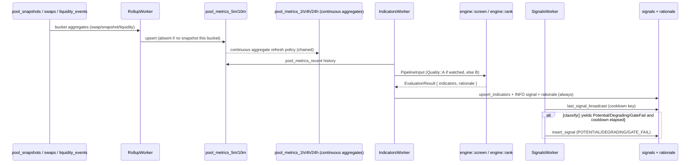

# Internals

`docs/architecture.md` covers how the four binaries and the schema fit together. This document
goes one level deeper: the worker-level logic inside each binary, and the library code those
workers call. It assumes the reader has read the architecture document first and does not repeat
what that document already establishes -- the two-tier pool model, the rollup chain shape, the
`Source`/`Venue` trait seams, and the schema's core/satellite split are covered there, not here.

## `bin/indexer`

`bin/indexer` runs six workers under one `tokio::JoinSet` (`bin/indexer/src/lib.rs`):
`DiscoveryWorker`, `StateWorker`, `EventWorker`, `TierWorker`, `HealthWorker`, and a
`MetricsWorker` that only serves the Prometheus endpoint. The first five are described below.

### Discovery: reconciling the chain against the database, never deleting

`DiscoveryWorker::tick` (`bin/indexer/src/workers/discovery.rs`) runs three passes every
`discovery_interval`:

1. Load the known universe from `storage::queries::scoring_universe`.
2. Call `Source::discover_pools` (a zero-data-slice `getProgramAccounts` scan on RPC, a
   burst-captured Geyser snapshot on Geyser) to get the chain's current pool set.
3. Diff the two sets three ways: addresses on-chain but not in the database are onboarded
   (`onboard_new_pools`); addresses already known have their cached `tvl_usd`, `is_blacklisted`
   and `launchpad` fields refreshed from the flow-metrics source (`refresh_known_pools`);
   addresses in the database but absent from the fresh scan are counted and logged at `warn`,
   never removed.

The onboarding path does a one-off full state read through `state_stream` (a `WatchSet` of exactly
the new addresses) rather than trying to build a `pools` row from a zero-slice discovery result --
discovery only ever returns an address, since the whole point of the zero-length data slice is to
keep the scan cheap enough to run on a timer. A pool that comes back with no decodable `LbPair` yet
is skipped with a `warn`, not retried in this same tick; the next discovery sweep will pick it up
once decodable.

The decision to never delete a row that disappeared from a scan is deliberate, not an oversight --
the comment in `discovery.rs` spells out why: an address missing from a fresh `gPA` scan could mean
the pool actually closed, a transient RPC gap, or (at larger scale) a filter regression, and none of
those should be resolved by silently dropping data that everything downstream -- `pool_metrics`,
`indicators`, paper positions -- still references by foreign key. The failure this avoids is a
transient RPC hiccup permanently erasing a pool's history because one scan happened to miss it.

### State: the coalescing rule and why the clear-after-write ordering matters

`StateWorker::run_once` (`bin/indexer/src/workers/state.rs`) re-reads the watch set from storage on
every refresh cycle (`watch_refresh_interval`, tied to the tier promotion interval) rather than
holding it fixed for the process lifetime -- so a promotion or demotion decided by `TierWorker`
takes effect on the next refresh without a restart. Inside one refresh cycle it drives a
`Source::state_stream` and buffers incoming `StateUpdate`s in a `StateBuffer`
(`bin/indexer/src/workers/state_buffer.rs`), flushing on whichever comes first: a fixed
`flush_interval` timer, the buffer reaching `flush_batch_size`, or the refresh deadline.

`StateBuffer` is a `HashMap<Pubkey, StateUpdate>` with one rule, enforced in `offer`: a new update
for a pool overwrites the buffered one unless the buffered one is at a strictly newer slot, in which
case the new update is dropped. The reasoning is in the module comment: Geyser gives no ordering or
completeness guarantee at all, and even a hot pool under RPC polling can accumulate more than one
update per pool within a single flush window. Keeping only the newest slot per pool means a flush
writes each pool's most current state once, not several stale intermediate ones.

The second half of the contract is in `flush` (`state.rs`): the buffer is drained into row batches,
those rows are written (`insert_pool_state`, `insert_active_bin_snapshots`, `insert_bin_states`,
`insert_fee_param_updates`, plus per-pool `upsert_dlmm_pool_params` refreshes), and only *after*
every write returns `Ok` does `buffer.clear()` run. If a write fails partway, the function returns
the error before reaching `clear()`, so the buffer -- still holding the un-written updates -- is
retried on the next flush tick rather than losing that data. This ordering is why `StateBuffer::clear`
is a separate method from `drain`, not folded into it: `drain()` just reads `entries.values().cloned()`
without touching the map, so a failed write can be discovered and the same drained data retried
without the buffer having already been emptied out from under it. `state_buffer.rs`'s own test,
`test_clear_only_after_flush_leaves_buffer_intact_on_failure`, exercises exactly this sequencing.

Per-pool state building (`StateWorker::build_rows`) is deliberately fallible-per-item rather than
fallible-for-the-batch: a Decimal overflow or a bad conversion for one pool's numbers is caught,
logged, counted in `metrics::DECODE_ERROR_TOTAL`, and skipped with `continue` inside the batch loop
in `flush`, so one pool's bad math never blocks the rest of the batch from being written.

Fee-parameter change detection lives here too, not in `EventWorker`: `last_params`, a
`Mutex<HashMap<Pubkey, PoolState>>` scoped to the worker's own lifetime, remembers the last decoded
`PoolState` per pool and `diff_fee_params` (`bin/indexer/src/convert.rs`) compares it against each
new read. This exists because there is no decoded on-chain event for a fee-parameter change yet
(`EventWorker`'s own comment says the same) -- a diff between consecutive polled reads is the only
signal available. Being an in-memory diff means it resets on every restart: a change that happened
while the process was down, and that has already reverted or been superseded by the time the
process comes back, will not be detected. This is treated as an acceptable gap for an operational
signal rather than a correctness-critical one.

### Events: synthetic keys, and why RPC's stream idles instead of spinning

`EventWorker::run_once` (`bin/indexer/src/workers/event.rs`) drives `Source::event_stream` the same
way `StateWorker` drives `state_stream` -- buffer, flush on interval or batch size, flush again on
cancellation. `ChainEvent` carries no transaction signature, so every event is stamped with a
synthetic key, `chain-event:{pool}:{slot}:{nonce}`, where `nonce` is a per-cycle counter --
needed because the schema's natural key for `swaps`/`liquidity_events` is
`(pool_address, ts, signature, ix_index)`, and without a synthetic component two events landing in
the same slot for the same pool would collide under that key and one would silently disappear
behind `ON CONFLICT DO NOTHING` instead of both being recorded.

On the RPC backend `event_stream` is `stream::empty()` by construction (see the source library
section below), so `run_once`'s inner loop reads `None` from the stream almost immediately.
`EventWorker` treats that specific case -- `BreakReason::StreamEnded` -- as the expected idle state
for that backend and sleeps for `flush_interval` before reopening the stream, rather than looping
tight against an endpoint that will keep returning nothing.

Several decoded event kinds -- `ClaimFee`, `ClaimFee2`, `LbPairCreate`, `PositionCreate`,
`PositionClose` -- are matched, logged at `debug`, and dropped; there is no write path for them in
the schema on either backend today.

### Tiering: promotion, the exploration slice, demotion hysteresis, and where the open-position exemption actually lives

`TierWorker::tick` (`bin/indexer/src/workers/tier.rs`) reads the screening rank `scorer` already
wrote to `indicators_10m.r_org` -- it computes no ranking itself. The pure decision function,
`select_tier_changes`, is kept free of I/O specifically so it is unit-testable without a database,
and its six tests in `tier.rs` are worth reading directly since they each pin down one of the
protections described in `docs/architecture.md`:

- `never_measured_pools` (`storage::write::tier`) selects pools with no `indicators_10m` row at
  all, ordered by `created_at DESC`; the first `exploration_n` of these are unconditionally added to
  the promotion set in `select_tier_changes`, regardless of screening rank.
- `safe_ranked` (fetched via `top_pools` with `rank_slots + demotion_margin` as the limit) is a
  wider set than `ranked`; anything in it is exempt from demotion even if it falls outside the
  strict cutoff, producing the hysteresis band.
- Any pool that is both watched and unmeasured survives its own promotion sweep: `select_tier_changes`
  unions `unmeasured` into the `safe` set before computing `demote`, so a pool promoted this tick via
  the exploration slice -- which by definition has no `indicators_10m` row yet -- cannot be demoted
  on the very same sweep, before `scorer` has had a chance to evaluate it even once.
- Open paper positions are also unioned into `safe` in `select_tier_changes`. The worker-level
  comment is explicit that this is only the first line of defence, though: the actual source of
  truth is enforced again inside `storage::write::tier::demote_pools` itself, whose `UPDATE`
  carries `AND NOT EXISTS (SELECT 1 FROM paper_positions pp WHERE pp.pool_address =
  pools.pool_address AND pp.closed_at IS NULL)` directly in the `WHERE` clause. That means a demotion
  sweep can never race an open position out of the watch set even if the in-memory check in
  `select_tier_changes` were ever wrong or bypassed by a different caller (`bot`'s `/watch off`
  command calls the same `demote_pools` function, and gets the same protection for free). The
  failure this prevents: ending a pool's bin-state subscription mid-position would corrupt the very
  measurement the paper position exists to produce.

`promote_pools` only flips pools not already at tier 1 (`WHERE ... AND tier <> $1`), which matters
because it means a pool re-promoted on a later sweep -- one that never actually left tier 1, or one
that flapped back in -- keeps its original `tier_changed_at` rather than having that clock reset by
every sweep it happens to still qualify for.

### Health: a heartbeat conditioned on progress, not liveness

`HealthWorker::tick` (`bin/indexer/src/workers/health.rs`) writes an `ingest_health` row every tick
regardless of anything else, but the `info`-level heartbeat log line only fires when two conditions
both hold: `fresh` (the most recent on-chain time is within `freshness_threshold` of wall clock) and
`progressed` (more rows have been written since the last tick than were written the tick before
that, tracked via an `AtomicU64` snapshot-and-swap on `rows_written_total`). A process that is still
running, still connected, and still writing rows -- but writing the *same* stale slot's worth of
rows over and over, or writing rows whose on-chain timestamp has stopped advancing -- produces no
heartbeat line at all under this rule, rather than a reassuring "healthy" log that would be
technically true (the process is alive) and practically false (it is not doing useful work). The
worker's own comment states the intent directly: silence becomes the alert instead of a log line
nobody is watching, since a wedged-but-connected process is exactly the failure mode a liveness-only
check cannot distinguish from a healthy one.

### Sequence: chain to `pool_snapshots`

```mermaid
sequenceDiagram
    participant Chain as Solana (RPC or Geyser)
    participant SS as Source::state_stream
    participant Buf as StateBuffer
    participant SW as StateWorker
    participant DB as Postgres

    Chain->>SS: account update (LbPair / BinArray)
    SS->>SW: StateUpdate { pool, slot, block_time, lb_pair, bin_arrays }
    SW->>Buf: offer(update)
    Note over Buf: newer slot replaces older;<br/>older slot for a buffered pool is dropped
    alt flush_interval elapses, or buffer full, or shutdown
        SW->>Buf: drain()
        SW->>SW: build_rows() per pool (isolated failures)
        SW->>DB: insert_pool_state / insert_active_bin_snapshots /<br/>insert_bin_states / insert_fee_param_updates
        alt write succeeds
            SW->>Buf: clear()
        else write fails
            Note over Buf: left intact -- retried on next flush
        end
    end
```

## `bin/scorer`

`bin/scorer` runs four independent worker groups: `RollupWorker`, `IndicatorsWorker`,
`SignalsWorker`, and `PaperPositionWorker` (which itself runs two tick loops -- open/mark and
outcomes -- under one `Worker::run`). None waits on another; each reads whatever the others have
most recently written and degrades to an empty or stale-but-present result rather than blocking.

### The rollup chain: which tables are application-written, and why the split exists

`RollupWorker::tick` (`bin/scorer/src/rollup/worker.rs`) builds exactly two tables itself:
`pool_metrics_5m` (tier-1/watched pools only, every tick) and `pool_metrics_10m` (both tiers, only
on a tick whose floored bucket boundary is a multiple of ten minutes). Both are populated through
`upsert_pool_metrics_5m`/`upsert_pool_metrics_10m`, which are `ON CONFLICT (pool_address,
bucket_start) DO UPDATE` -- idempotent by construction, so a retried tick or a redundant write
overwrites rather than duplicates. `RollupWorker` never touches `pool_metrics_1h`, `_4h` or `_24h`;
those three are real TimescaleDB continuous aggregates (`migrations/0012_pool_metrics_1h.sql`
through `0014`), each with its own `add_continuous_aggregate_policy`, and they chain off each other
-- `1h` refreshes from `10m`, `4h` from `1h`, `24h` from `4h` -- rather than each refreshing
independently from raw data.

The reason `5m`/`10m` are plain application-managed tables rather than continuous aggregates too is
visible directly in the code that builds them: `fetch_and_build` in `rollup/worker.rs` joins four
separately-queried aggregates (`swap_bucket_aggregates`, `pool_snapshot_bucket_aggregates`,
`liquidity_bucket_aggregates`, `active_tvl_median`) with per-pool `HashMap` lookups and an
absent-vs-null decision that a `GROUP BY` over raw tables cannot express on its own (see below).
Building `1h` from `10m` rather than from raw data also has a structural payoff `1h`'s own migration
comment states plainly: every pool has a 10-minute base -- rolled up from `5m` for tier-1, native
resolution for tier-0 -- so once `10m` has reconciled the two bases, every aggregate built on top of
it is automatically uniform across tiers; there is no separate "which base does this pool have"
question to answer again at `1h`, `4h` or `24h`.

`RollupWorker` also never catches up: `tick` always builds the bucket ending at the current floored
time (`floor_bucket`), never a backlog of buckets missed while the process was down. A `scorer`
outage therefore leaves a permanent hole in `pool_metrics_5m`/`10m` for that window, and since `1h`
onward is built from `10m`, that hole propagates forward through every coarser aggregate rather than
being invisible once time passes.

### The absent-versus-zero rule, and what breaks if it is violated

`build_bucket_from_raw` (`bin/scorer/src/rollup/build.rs`) is a pure function, deliberately separated
from the storage calls that feed it so this rule is testable without a database. Its entire contract
is one line: presence of a `snapshot` argument (the pool-state aggregate for the bucket) is the sole
gate on whether a row exists at all --

```rust
pub fn build_bucket_from_raw(
    pool_address: &str,
    bucket_start: DateTime<Utc>,
    swap: Option<&SwapBucketAgg>,
    snapshot: Option<&SnapshotBucketAgg>,
    liquidity: Option<&LiquidityBucketAgg>,
    active_tvl_median: Option<Decimal>,
) -> Option<NewPoolMetricsBucket> {
    let snapshot = snapshot?;
    ...
```

If there is no pool-state observation in the bucket, the function returns `None` and no row is
written for that pool/bucket at all -- not a row with `volume_usd` and the rest zeroed out. If a
state snapshot *is* present but there were no swaps, the row exists with `volume_usd`/`swap_count`/
etc. left `None` (SQL `NULL`), not `0`. The module comment frames this precisely: the distinction is
about the row as a whole, not individual columns within it -- a tier-0 pool observed only on the
10-minute universe scan legitimately has no forced 5-minute state sample, and a bucket built for it
anyway (even with every numeric field left null) would still be a lie about the row itself having
been observed.

This matters downstream in a way that is easy to get wrong: TimescaleDB's `sum()` and `last()`
aggregates used to build `pool_metrics_1h`/`4h`/`24h` treat a missing row as contributing nothing to
the sum, which is correct -- but a *present* row with `volume_usd = 0` would also contribute nothing
to a `sum`, yet would count as one more sample in a `count()`, would set an `active_bin_open`
identical to the previous close and produce a manufactured zero-return bar for the volatility
pipeline, and would let a query like "how many buckets did this pool have a snapshot in" silently
overcount. Any code path that starts writing zero-filled rows for un-observed buckets would corrupt
exactly those aggregates without producing an error anywhere -- the failure is quiet, not loud, which
is why the rule is enforced at the one function that builds every row rather than left as a
convention callers are expected to honour.

### Indicators: the screen/rank dispatch, and rationale written even for evaluations that emit no signal

`IndicatorsWorker::tick` (`bin/scorer/src/indicators/worker.rs`) iterates the full scoring universe
at all five `Timeframe::ALL` values every `indicators_interval`. For each pool/timeframe pair,
`evaluate_pool`:

1. Fetches `HISTORY_ROWS` (`288 * 7 + 4`, a week of 5-minute-equivalent bars plus margin) of
   `pool_metrics` history and hands it to `pipeline::assemble` (`bin/scorer/src/pipeline/history.rs`).
   If there is no current bucket at all, `assemble` returns `None` and `evaluate_pool` returns
   `Ok(())` immediately -- nothing is written, and the comment is explicit that there is nothing to
   explain the silence of either: an indicator row and its rationale only exist once there is
   something to evaluate.
2. Loads `RegimeState` and `VolatilityState` from `regime_state`/`volatility_state`
   (`storage::queries::load_regime_state`/`load_volatility_state`), falling back to fresh state only
   if no row exists yet.
3. Loads trigger-persistence history (`indicator_history`, looking back
   `TRIGGER_HISTORY_LOOKBACK_HOURS = 72`) for the exit-condition checks.
4. Reads the measured active-bin liquidity from `active_bin_snapshots` only when the pool is
   currently watched (`is_watched`); an unwatched pool's `PipelineInput.measured_active_bin_liquidity`
   is always `None`, forcing the pipeline's own TVL-based estimate.
5. Calls `engine::rank` if the pool is watched, `engine::screen` otherwise -- the only difference
   between the two call sites is which one of these functions runs and, transitively, which
   `Quality` tag lands on the row.
6. Writes `regime_state`/`volatility_state` back (`upsert_regime_state`/`upsert_volatility_state`),
   then the `indicators_{tf}` row (`upsert_indicators`), then a `signals` row of kind `INFO` with the
   pipeline's full `rationale` trail attached (`insert_signal_with_rationale`).

That last write happens unconditionally, on every evaluation, whether or not the pool passed the
risk gate, whether or not it turned out attractive. `signals` therefore doubles as the audit trail of
every evaluation ever run, not just the interesting ones -- `/why` in `bin/bot` reads exactly this
table, and it can explain *why nothing happened* as completely as it can explain a signal, because
the rationale for a risk-gate rejection is written with the same completeness as the rationale for a
successful rank.

### Regime hysteresis surviving a restart

`RegimeState` (`libraries/engine/src/regime.rs`) is explicitly modelled so it can round-trip through
a database row rather than living only in a running process's memory -- `regime_state_to_row`/
`regime_state_from_row` in `bin/scorer/src/state.rs` are the two directions of that round trip, and
the table itself (`migrations/0023_scorer_worker_state.sql`) carries one row per
`(pool_address, venue, timeframe)`, since each timeframe's pipeline evaluation is independent and
needs its own hysteresis clock. `RegimeState::update` is the state machine: a candidate regime that
differs from the committed one must persist for `RegimeConfig::persistence` (default 30 minutes)
before it commits, and even once it would commit, a `cooldown` (default 2 hours) since the *last*
transition can still block it. Without the database round trip, both clocks would reset to zero on
every restart, and a pool that had been 25 minutes into a persisting regime change would have to
start counting over -- exactly the kind of state a restart-driven redeploy would otherwise silently
undo.

### Signal dedup and cooldown

`SignalsWorker` (`bin/scorer/src/signals/worker.rs`) re-evaluates the same trigger logic
`IndicatorsWorker` already ran, but against the persisted `indicators` row rather than recomputing
the pipeline, and only over the watched set. `classify` (`bin/scorer/src/signals/classify.rs`) turns
a row plus an exit-trigger boolean into one of `Potential`/`Degrading`/`GateFail`, or `None` -- a
`Quality::B` (screening) row is never eligible at all, since a screening estimate is not something
worth announcing on its own.

Cooldown is the interesting design choice: `Cooldown::is_due` (`bin/scorer/src/signals/cooldown.rs`)
is a pure comparison against `last_signal_broadcast`, which reads the most recent `signals` row
matching `(pool_address, timeframe, kind)` from the database -- there is no in-memory cooldown table
at all. The module comment explains why this needed no separate persistence mechanism of its own:
`signals` already carries exactly the key a cooldown decision needs, so reusing it follows the same
pattern as `regime_state`/`volatility_state` without a new table. This is *not* true of the
`IndicatorsWorker`'s own emission of `INFO`-kind signals, though: those are written every tick
regardless of cooldown, since they are the audit trail, not an announcement -- only the
`POTENTIAL`/`DEGRADING`/`GATE_FAIL` kinds `SignalsWorker` writes are subject to the cooldown check.
The cooldown key is read from the persisted `signals` table via `last_signal_broadcast`, so a
restart does *not* reset it and a pool announced shortly before a restart is not re-announced
immediately after one. Regime state, volatility state and the signal cooldown are the same
persistence pattern applied three times, rather than two persisted mechanisms sitting next to one
that forgets.

### Paper positions: open, mark, and outcome, on two independent cadences

`PaperPositionWorker::run` (`bin/scorer/src/paper/worker.rs`) joins two `tick_loop`s: `open_and_mark`
on `mark_interval`, and `outcomes` on `outcomes_interval`. `try_open` gates on the 1-hour timeframe
specifically -- stable enough not to flip open/closed on every 5-minute tick, short enough to react
to a pool that just started qualifying -- and only opens a position when `classify` on the pool's
`h1` row returns `Potential`. Sizing reuses `engine::sizing::evaluate` with the same inputs the
pipeline itself would use; a paper position never touches the chain, holds no key, and signs
nothing -- it is a database row from the moment it is opened.

Marking (`build_mark`) estimates fee income per interval via `estimated_fee_share`
(`bin/scorer/src/paper/accrual.rs`): the position's `size_per_bin` as a fraction of
`size_per_bin + active_bin_liquidity`, applied to the pool's actual `trade_fee_usd` for the interval,
and only while the position is in range. The accrual module's own comment is explicit that this is
an estimate, not the true per-bin `fee_*_per_token_stored` delta that `bin_states` would let it
compute exactly -- reasonable, since no chain interaction happens in this worker at all and the
estimate only ever applies while in range.

`OUTCOME_HORIZONS` is `[("24h", 24), ("72h", 72)]` -- every position is finalized at exactly these
two horizons regardless of which regime it was opened under, which is a known scoping gap rather
than an accident: `docs/architecture.md` already notes a longer horizon referenced in nearby code
comments for the stable regime is not implemented. `finalize_outcome` computes `r_real` as
`fees_real / |lvr_real|` only when both are present and the LVR magnitude is non-trivial
(`> 1e-9`); otherwise `r_real` and `hit` are left `None` rather than a divide producing a nonsensical
number.

### Sequence: rollup to signal



## `libraries/source`

One trait, `Source` (`libraries/source/src/lib.rs`), two implementations. `Capabilities`
(`libraries/source/src/domain.rs`) exists so the scorer's organic-flow estimator can know, per
backend, whether timing-based evidence (`push_latency`) and a buy/sell split
(`buy_sell_split`) are actually available rather than silently defaulting to zero -- the comment on
the struct is explicit that this is not decoration: an alert has to be able to say which estimators
fed it. `GeyserSource` reports all four fields `true`; `RpcSource` reports `swap_level_events: false`
and `own_flow_metrics: false` (it defers to the datapi client instead).

### Geyser backend

**Subscription filter shapes.** `libraries/source/src/geyser/filters.rs` builds every
`SubscribeRequest` the backend sends. Two points worth knowing:

- Yellowstone unions matches *across* named filter entries in a request's `accounts` map (an account
  hits the subscription if it matches any one named filter) but ANDs the conditions *within* one
  entry. Since `LbPair` and `BinArray` accounts never share a discriminator, they need two separate
  named filters (`LB_PAIR_FILTER`, `BIN_ARRAY_FILTER`) rather than two memcmp conditions crammed into
  one entry, which would match nothing at all.
- `bin_array_account_filter` returns `Option<SubscribeRequestFilterAccounts>`, not a filter with an
  empty `account` list, when no watched pool yet has a known active bin. The reason is stated
  directly in the comment: an empty account list on this field means *unconstrained* in the wire
  protocol -- it would subscribe to every `BinArray` the program owns, not to nothing. Getting this
  backwards would turn a narrow, per-pool subscription into the entire program's bin-array traffic
  the first time a request happened to have no bin arrays to ask for yet (e.g. immediately after a
  fresh promotion). `lb_pair_account_filter`, by contrast, is always safe to call with a possibly-empty
  pool list, since it is scoped by `account` rather than being the thing that decides whether the
  whole request is constrained.

**BinArray PDA derivation shared with RPC.** `libraries/source/src/bin_array.rs` is used by both
backends without modification -- `bin_array_pda`, `bin_array_index`, and `surrounding_bin_arrays`
(the active bin's array plus its immediate neighbours either side) live in one module the whole
`source` crate shares. A test in `filters.rs`
(`test_bin_array_filter_matches_the_rpc_backend_derivation`) exists specifically to pin this down:
both backends, given the same pool and the same active bin, must derive the identical three PDAs.
If the two backends ever derived different arrays, a pool watched under one backend and then
switched to the other (a config change, per the architecture document) could silently start reading
a different slice of bin state without anyone noticing a schema change -- the shared function is
what makes that impossible by construction rather than by convention.

**Live resubscription on active-bin crossing, debounced.** `ResubscribeTracker`
(`libraries/source/src/geyser/state.rs`) tracks, per pool, which `BinArray` index the live
subscription is currently centred on. `observe` returns `true` whenever the pool's newest active bin
falls in a different array index than the one it is subscribed for -- including the first time a
pool is ever observed. When that happens, `coalesce_loop` sets `resubscribe_dirty` and resets a
`RESUBSCRIBE_DEBOUNCE` (3 second) timer rather than firing a resubscribe immediately. The debounce
exists because the three-array window already covers one crossing's worth of movement -- a pool
sitting right on a boundary and flapping between two adjacent arrays would otherwise trigger a fresh
`SubscribeRequest` on every single flip, and Yellowstone accepts a fresh request on the same open
sink without a reconnect, but that is still churn worth avoiding when the existing window already
tolerates the common case.

**Stream liveness via ping and a dead timer.** `run_once`
(`libraries/source/src/geyser/connection.rs`) runs two independent timers in one `select!`: a short
`ping_interval` (5s default) that sends a `SubscribeRequestPing` up the sink -- itself wrapped in a
`ping_send_timeout` so a wedged sink cannot block the loop forever -- and a longer `pong_timeout`
(30s default) that is reset only by an inbound ping or pong from the server. If the long timer fires,
the stream is declared dead and the function returns `StreamError::Failed`, triggering a reconnect.
The comment frames this as the actual Geyser failure mode worth guarding against: a connection that
looks open at the TCP level but has stopped delivering anything looks nothing like a clean
disconnect, so liveness has to be measured by traffic, not by socket state.

**Reconnect with slot replay.** `run_resilient` reconnects with exponential backoff (jittered,
`ReconnectPolicy::default()` capping at 240 attempts before giving up and ending the stream
entirely -- deliberately, so a supervisor watching the process notices it exited rather than the
indexer being quietly stuck offline for days). Each reconnect attempt calls `build_request` with the
highest slot seen so far (`last_slot`) as `from_slot`, so Yellowstone replays the gap between the
last observed slot and the new subscription rather than the process losing whatever happened during
the outage.

**Slot-gap detection.** `SlotTracker::observe` (`connection.rs`) compares each incoming slot against
a high-water mark; a slot more than one past the mark logs a `SlotGap` at `warn` and increments
`STREAM_RECONNECT_TOTAL`. Since Geyser gives no ordering or completeness guarantee, this is the only
mechanism that turns a silently dropped notification into something visible in the logs and metrics
rather than an unexplained hole in the data.

### RPC backend

**Grouped account batching.** `libraries/source/src/rpc/batching.rs`'s `pack_groups` bin-packs whole
`AccountGroup`s (a pool's `LbPair` plus its three surrounding `BinArray`s, or just the `LbPair` for a
pool whose active bin is not yet known) into batches capped at `MAX_POOL_KEYS_PER_BATCH` (99) keys,
first-fit, and explicitly never splits one pool's group across two batches -- the doc comment states
the reason directly: reading a pool's `LbPair` and its `BinArray`s in different batches would mean
reading them at different slots, producing an active-bin-liquidity figure that describes no single
moment in time.

**The Clock sysvar appended to every batch.** `StatePoller::fetch_state_batch`
(`libraries/source/src/rpc/state.rs`) always appends `CLOCK_SYSVAR`
(`libraries/source/src/rpc/clock.rs`) as the last key in every `getMultipleAccounts` call --
`MAX_POOL_KEYS_PER_BATCH` is `MAX_KEYS_PER_CALL - 1` specifically to reserve that slot. This gives
every batch its own authoritative `(slot, unix_timestamp)` pair with no extra round trip and no
possibility of skew between a state read and a separately-fetched `getSlot`/`getBlockTime` call. The
dynamic-fee volatility accumulator decays against this on-chain time, never wall-clock time.

**Negative caching.** `NegativeCache` (`libraries/source/src/rpc/cache.rs`) is used by
`DatapiClient::flow_metrics` (`libraries/source/src/rpc/datapi.rs`), not by account reads -- the
public data API's `/pools` endpoint has no per-pool filter, so answering *any* flow-metrics query
means walking every page. When every pool in a requested batch is a confirmed-recent miss (delisted,
or simply not yet indexed by the upstream API), `flow_metrics` skips the page walk entirely rather
than paying for it on every discovery tick just to learn nothing again. Misses expire after
`negative_cache_ttl`, so a pool that later does show up in the API is not permanently blacklisted
from being asked about again.

## `libraries/engine`

**Volatility estimation.** `libraries/engine/src/volatility.rs`'s `VolatilityState` carries two EWMA
variance estimators (`sigma_fast_variance`, `sigma_slow_variance`, decayed at `LAMBDA_FAST`/
`LAMBDA_SLOW` from `dlmm_math`) plus `first_observed_at`, which drives a cold-start rule:
`sufficient_history` is `false` until `MIN_HISTORY_DAYS` (3.0) have elapsed since the pool's series
began, and the pipeline treats an insufficiently-aged pool's regime candidate as `None` regardless of
what the raw numbers say -- there is no meaningful "fast vs. slow" comparison to make from a few
hours of data. `sigma_d`, the daily volatility figure the ranking formula actually consumes, is
computed via `dlmm_math::daily_vol` from the fast-EWMA variance and a set of lag autocorrelations
(only computed at the 5-minute timeframe; other timeframes pass an empty slice, which `daily_vol`
handles as the uncorrected case).

**Regime classifier and its hysteresis.** Two independent mechanisms are both load-bearing here, and
the doc comment on `classify_candidate` (`libraries/engine/src/regime.rs`) is explicit that neither
alone is sufficient. `classify_candidate` itself applies asymmetric enter/exit bands per regime (a
Schmitt trigger) -- S's exit threshold on `sigma_fast` (0.01) is higher than its enter threshold on
`sigma_slow` (0.005), so a pool sitting near the boundary does not relabel every tick purely from the
enter/exit gap. `RegimeState::update` then applies time-based hysteresis on top of that: a candidate
that differs from the committed regime must hold for `persistence` (30 minutes default) before it
commits, and even a persisted candidate can be blocked by `cooldown` (2 hours default) since the last
actual transition, unless `kill_switch` bypasses both. Both checks emit a `RationaleItem` -- even the
"regime is stable, nothing changed" case writes `regime_stable_minutes` as an informational entry
via `rationale::info`, so a rationale trail always has exactly one regime-stage entry per evaluation.

**The risk gate.** `libraries/engine/src/risk_gate.rs::evaluate` runs every configured check every
time, unconditionally -- there is no early return on the first failure. The reasoning is in the
function's own doc comment: this is what lets `/why` explain a rejection in full, listing every check
that failed and against what threshold, rather than only the first one encountered. `RiskGateInputs`
uses `Option<T>` for signals that need a paid data source or a scan this pipeline does not currently
perform (`top10_holder_share`, `insider_bundle_flagged`, `other_venue_depth_ratio`); when one of
these is `None`, the corresponding check calls `rationale::unavailable` rather than either failing or
silently passing on fabricated data. `rationale::unavailable` sets `observed = f64::NAN` and
`passed = true` -- the `NaN` is the typed marker that the check was skipped, not evaluated and found
true, and a caller can always distinguish it from a real zero by checking `observed.is_nan()`.
`bin/scorer/src/pipeline/universe.rs::risk_gate_inputs` is the concrete assembly point: several
fields the gate wants (Token-2022 extension flags, the wash-trading signer share, Jupiter route
depth) are not yet read from any data source the scorer has, so they are set to values that read as
"nothing observed, pass through neutrally" -- `token2022_has_permanent_delegate: false`,
`signer_top_n_share_of_24h_volume: 0.0`, and so on -- rather than `Option::None`. This is worth
flagging because it means those specific checks are running today, in the live pipeline, against
inputs that are not actually measured -- they always pass, which is a different thing from being
marked `unavailable`. `docs/architecture.md` names the same gap; the code in `universe.rs` is where
it is concretely visible.

**The two-stage screen/rank split and the quality A/B distinction.** `engine::pipeline::screen` and
`engine::pipeline::rank` (`libraries/engine/src/pipeline.rs`) are both thin wrappers around one
private `evaluate` function, differing only in the `Quality` tag they pass through
(`Quality::B`/`Quality::A`) and, transitively, in one branch: `Quality::A` prefers
`input.measured_active_bin_liquidity` when present, falling back to the TVL-times-`phi_shape`
estimate only if that measurement is missing (e.g. a freshly-promoted pool with no bin snapshot yet);
`Quality::B` always uses the TVL estimate. `phi_shape` (`pipeline.rs`) is a per-regime constant --
0.16 for Stable, 0.04 for V1, 0.02 for V2 -- reflecting that a stable pair concentrates nearly all of
its liquidity in a handful of bins around a fixed peg while a volatile pair spreads liquidity across
a much wider range, so the same TVL implies very different active-bin depth depending on regime.
Every numeric field the two functions populate is the same shape; only the values and the `quality`
tag differ, which is exactly what `pipeline.rs`'s own test,
`test_screen_and_rank_produce_same_shape_with_different_quality`, checks directly. `evaluate` returns
early -- skipping ranking, sizing and triggers -- as soon as regime classification fails to commit, or
the risk gate fails, or the fee-forecast computation errors; in every one of those early-return paths
the `rationale` vector accumulated so far is still returned alongside the partially-filled
`Indicators` row, so the caller always has something to persist and explain, never a bare failure.

**The typed rationale structure.** `libraries/dlmm_math::RationaleItem` (`{ signal, observed, cmp,
threshold, passed }`) is the one shape every check in `engine` produces, built through exactly three
constructors in `libraries/engine/src/rationale.rs`: `check` (a real comparison, the only place
`passed` is derived from actual arithmetic), `unavailable` (the `NaN`-marked skip described above),
and `info` (a value worth recording with no pass/fail meaning at all, always `passed: true`, used for
observations like "was this data available this tick"). Every stage in the pipeline goes through one
of these three, which is what makes the rationale trail diffable and typed rather than free text --
`scorer`'s `to_rationale_rows` (`bin/scorer/src/indicators/convert.rs`) stringifies each field for
storage, but the observed value's `NaN`-vs-number distinction survives the round trip, since the
renderer formats `f64::NAN` as the literal string `"NaN"` rather than something that looks like a
real zero.

## `libraries/storage`

`libraries/storage` is the only crate in the workspace permitted to contain a SQL query -- the
comment at the top of `libraries/storage/src/lib.rs` states the rule, and CI enforces it by grepping
the rest of the tree for direct `sqlx::query` use. `bin/bot`'s `handlers.rs` and every scorer/indexer
worker call typed functions from `storage::queries`/`storage::write` and never construct a query of
their own. This is also the seam a second consumer (an HTTP API, in the "extension seams" language
of `docs/architecture.md`) would extend through, rather than around.

**Migrations run from one baked-in directory.** `storage::run_migrations`
(`libraries/storage/src/migrate.rs`) wraps a `static MIGRATOR: sqlx::migrate::Migrator =
sqlx::migrate!("../../migrations")`, compiled in at build time from the workspace-root
`migrations/` directory -- the same directory `make migrate` (sqlx-cli) targets, so the two paths to
running migrations cannot drift apart by pointing at different files. `sqlx::migrate!`'s runner takes
Postgres's own advisory lock internally, which is why `docs/architecture.md`'s claim that `indexer`,
`scorer` and `crawler` racing to migrate a fresh database is safe holds: each blocks on the lock until
whichever one got there first finishes.

**Four layers of tables, each with a different durability contract.** Reading the schema by what
each layer is allowed to lose clarifies the shape faster than reading it table-by-table:

1. **Raw, append-only tables** -- `swaps`, `liquidity_events`, `fee_param_updates`,
   `pool_snapshots`/`dlmm_pool_state`, `bin_states`, `active_bin_snapshots`. Each carries a
   retention policy (`migrations/0022_retention_and_compression.sql`): 7 days for `swaps` (the
   dominant volume driver on the Geyser backend, deliberately started conservative rather than sized
   from a guess), 90 days for most of the rest, 14 days for `bin_states` specifically (its raw
   per-bin volume is roughly two orders of magnitude larger than the active-bin-only snapshot table,
   which is why the two were split into separate tables in the first place rather than one wider
   one). Once a chunk ages out, that raw evidence is gone permanently -- nothing downstream can
   reconstruct it.
2. **Application-written rollups** -- `pool_metrics_5m`/`10m`. Built by `RollupWorker`, upserted
   idempotently, retained indefinitely (compressed after 30 days but never dropped), because they
   are the durable long-term record once the raw layer above them has expired.
3. **True continuous aggregates** -- `pool_metrics_1h`/`4h`/`24h`. Materialized and refreshed by
   TimescaleDB's own policy jobs, chained off `10m`/`1h`/`4h` respectively rather than off raw data,
   also compressed after 30 days, never dropped.
4. **Decision/evidence tables** -- `indicators_{5m,10m,1h,4h,24h}`, `signals`, `rationale`,
   `regime_state`, `volatility_state`, `paper_positions`, `position_marks`, `outcomes`. Kept
   indefinitely everywhere, since this is the layer that records what the system actually decided
   and why -- rebuilding it from expired raw data is impossible once the raw layer above has been
   compacted or dropped, so this layer is treated as the durable artifact the whole retention scheme
   protects.

**Idempotency is achieved differently per layer, matching the write pattern each layer needs.** Raw,
append-only tables use `INSERT ... ON CONFLICT (...) DO NOTHING` keyed on the natural identity of the
event -- `(pool_address, ts, signature, ix_index)` for swaps and liquidity events,
`(pool_address, ts)` for pool/bin snapshots, `(pool_address, bin_id, ts)` for bin states,
`(pool_address, ts, signature, field)` for fee-parameter updates. A retried flush (the exact case
`StateWorker`/`EventWorker`'s buffer-clear-after-write ordering is designed to trigger) replays the
same rows and the conflict clause silently drops the duplicates rather than erroring or double-
counting. State/derived tables that represent "the current value of X" instead use
`ON CONFLICT ... DO UPDATE SET ...` -- `pools`, `dlmm_pool_params`, `tokens`, `muted_pools`,
`indicators_{tf}`, `pool_metrics_{5m,10m}`, `regime_state`, `volatility_state`, `outcomes` all upsert
this way, since a later write for the same key is meant to supersede the earlier one, not coexist
with it. `signals` rows are plain inserts against a generated UUID primary key -- each row is
inherently a distinct event, so there is no natural conflict key to de-duplicate against in the first
place; de-duplication for the things that actually need it (the `POTENTIAL`/`DEGRADING`/`GATE_FAIL`
cooldown) happens one layer up, in `SignalsWorker`'s own read-then-decide logic, not at the write
layer. `rationale` sits between the two patterns: it is append-only like the raw layer
(`ON CONFLICT (signal_id, seq) DO NOTHING`), but keyed against the parent `signals` row's UUID rather
than a chain-derived natural key, since a rationale row's identity only makes sense relative to the
evaluation it belongs to.

## `bin/bot`

**Authorization.** `is_authorized` (`bin/bot/src/auth.rs`) is a single allow-list membership check --
`allowed.contains(&chat_id)` -- called before any command dispatch. The module comment frames the
threat model precisely: a leaked bot token still cannot pull anything out of a chat that is not on
this list, since Telegram routes updates by chat and the allow-list is the one gate every incoming
update has to pass regardless of what command it carries.

**Command parsing.** `bin/bot/src/cli.rs` parses the raw message text with `clap` rather than
hand-rolled string matching -- `Cli::try_parse_from` over whitespace-split tokens gives typed
arguments, subcommands, and `--help` for free, and clap's own error text is judged good enough to
send straight back into the chat rather than writing a second layer of user-facing error messages.
`normalize_first_token` strips a leading `/` and any `@BotName` suffix Telegram appends in group
chats before the tokens reach clap, since clap has no concept of either.

**Rendering: pagination.** Telegram caps a single message at 4096 characters
(`render::paginate::MESSAGE_LIMIT`), and a `/why` dump of a long rationale trail routinely exceeds
that. `paginate` never truncates content to fit -- the module comment is explicit that every line of
rationale is a reason someone might need to see, not a nice-to-have to drop -- it packs lines
greedily up to the limit and, once it knows more than one page is needed, re-packs at a smaller
`reserved_limit` (leaving room for a `"(continued i/n)"` footer) so the footer never has to push a
page over budget after the fact. The one place it does split *within* a line
(`split_long_line`, reached only when a single line exceeds the whole page budget on its own) is
careful never to cut immediately after a trailing backslash, since MarkdownV2 escape pairs like
`\.`/`\-` would otherwise be separated from the backslash that escapes them, breaking Telegram's
parser for whichever page the dangling backslash landed on.

**Rendering: escaping.** `escape_markdown_v2` (`bin/bot/src/render/escape.rs`) escapes the full
MarkdownV2 special-character set for any text the bot did not author itself -- a pool address, a
clap error, a rationale note -- since Telegram rejects the *entire* message if even one of those
characters appears unescaped outside a code span. `escape_code_span` is a narrower variant for text
placed inside a monospace span, where only the backtick and the backslash itself need escaping; using
the full escape set there would double-escape characters like `.` and `-` that are already literal
inside a code span.

**The bot computes nothing.** Every branch of `dispatch` (`bin/bot/src/handlers.rs`) either reads a
`storage::queries` function and renders the result, or calls a `storage::write` function that already
exists for a reason unrelated to the bot -- `/watch` calls the same `promote_pools`/`demote_pools`
`TierWorker` uses, `/mute` calls `mute_pool`, which any future consumer could call identically. The
one place `handlers.rs` does its own arithmetic is re-sorting an already-fetched result set by a
different key than the query itself ordered by (`/top`'s `CANDIDATE_MULTIPLIER = 5` overfetch,
re-sorted by `top_score` since no query returns a `top_score`-ordered set directly) -- the module
comment is careful to call this rendering logic, not scoring: it reorders numbers `scorer` already
computed, it does not compute a new one.

## `bin/crawler`

`crawler` is a one-shot, operator-run tool (`bin/crawler/src/lib.rs`'s module doc says so directly):
not a long-running worker, not wired into `indexer`'s startup, invoked by hand against a chosen pool
set and a slot or time range. It exists because of a real live-ingestion gap `docs/architecture.md`
already names: RPC's `event_stream` is permanently empty, and even Geyser's real per-swap stream can
drop a window during an outage the reconnect's slot-replay cannot fully recover (a Yellowstone
outage can exceed the provider's own retention). `crawler` walks `getSignaturesForAddress` backward
per pool and decodes each in-range transaction directly, writing into the same `swaps`/
`liquidity_events` tables the live indexer writes.

**What it backfills, exactly.** `crawl_pool` (`bin/crawler/src/crawl.rs`) pages backward through
signatures via `HistoryClient::signatures_page`, classifies each one's slot/time against the
requested range (`range::classify`: `TooNew` / `Within` / `TooOld`, the latter ending the walk for
that pool), skips failed transactions (their inner instructions never committed, so nothing to
decode -- though they still count toward `transactions_seen` for progress accounting), and for every
remaining transaction calls `convert::decode_transaction`
(`bin/crawler/src/convert.rs`). That function walks every self-CPI inner instruction whose
`program_id_index` resolves to the DLMM program id -- resolving account keys through both the
message's own key list and any address-lookup-table entries the transaction loaded
(`account_keys`) -- decodes each with `dlmm_decode::decode_event`, filters to the pool being
crawled, and derives a stable `ix_index` by combining the inner-instruction group's top-level index
with the event's position inside that group (`group.index * 1_000 + position`), since two events in
one transaction always share a signature and timestamp and the schema's natural key needs a third
component to tell them apart. `append_rows` then maps each decoded event into the same
`NewSwap`/`NewLiquidityEvent` shape the live indexer's `EventWorker::handle_event` produces --
deliberately field-for-field identical, per the module's own comment, so a range covered by both the
crawler and live ingestion produces indistinguishable rows for the overlap, differing only in
whether `signature`/`ix_index` are real (crawler) or synthetic (live ingestion). Resumability comes
from `Checkpoints` (`bin/crawler/src/checkpoint.rs`), written with a write-to-temp-then-rename so a
killed process never leaves a half-written, unparseable checkpoint file behind; `resume_plan` only
resumes a walk whose stored range matches the requested range exactly -- an operator who reruns with
a wider or shifted range gets a fresh walk rather than a checkpoint silently truncating the newly
requested part.

**What it cannot backfill, and why that is inherent rather than an omission.** `crawler` recovers
event *flow* -- swaps and liquidity events -- never pool *state*. `bootstrap.rs`'s module comment
states the underlying constraint plainly: plain RPC has no way to read an account's contents as of a
past slot at all. `getAccountInfo`/`getMultipleAccounts` return the account's *current* state only;
there is no historical equivalent short of an archival node with full account-state history, which
this system does not run and is not designed around. `ensure_pool_row` -- the one place `bootstrap.rs`
reads chain state at all -- uses exactly the same `source::rpc::StatePoller` the live indexer's state
worker uses, and reads the pool's state *as of right now*, purely to satisfy the foreign-key
requirement that `swaps.pool_address`/`liquidity_events.pool_address` reference an existing `pools`
row before any event row can be inserted; it is not, and cannot be, a historical reconstruction. A
signature walk only ever sees what one transaction *changed* (via its decoded events), never a full
account snapshot at the slot that transaction executed in -- so `pool_snapshots`, `dlmm_pool_state`,
`bin_states` and `active_bin_snapshots` have no recovery path for a gap in coverage, from either
ingestion backend, ever. This is a structural property of how Solana RPC exposes account data, not a
missing feature `crawler` could grow into: recovering historical account state would need a different
kind of node entirely.

One further limitation compounds this: even where `crawler` *does* fill a gap in `swaps`/
`liquidity_events`, it does not retroactively repair `pool_metrics`/`indicators` for the same window.
`RollupWorker` never revisits a bucket once its tick has moved past it (see the rollup section
above), so backfilled raw rows sitting underneath an already-built bucket do not cause that bucket to
be rebuilt -- the backfill makes the raw record complete, but the derived and decision layers above
it stay exactly as they were computed at the time, which for that window may still be built on a
gap.
